# Boutique_En_Ligne  

## Table des matières

1. [Le Projet](#Le-Projet)
2. [Contexte du projet](#Contexte-du-projet)
3. [acteurs et fonctionnalités](#acteurs-et-fonctionnalités)
4. [use case](#use-case)
5. [MCD / MLD](#mcd--mld)
6. [régles de cardinalités](#régles-de-cardinalités)
7. [régles métiers et contraintes divers](#régles-métiers-et-contraintes-divers)
9. [Controller/services/data](#Controllerservicesdata)
10. [requetages bdd / postman](#requetages-bdd--postman)
11. [IOC/DI](#iocdi)
12. [Commentaires divers](#Commentaires-divers)
12. [Installation/Mise en route](#installationmise-en-route)

## Le Projet:

   
Un système de gestion des produits pour un magasin en ligne

    Une entreprise de magasin en ligne souhaite gérer efficacement ses stocks de produit, ajuster les prix , permettre aux clients de faire des commandes et de             répondre aux besoins des clients de manière rapide et précise.
 

 ### Contexte du projet:
  
  

      
contexte

      Vous avez été chargé de développer un système de gestion des produits pour un magasin en ligne. L'objectif est de permettre aux propriétaires du magasin de gérer       efficacement leur catalogue de produits, d'ajouter de nouveaux produits, de mettre à jour les informations existantes et de suivre les stocks. Voici un ensemble       de fonctionnalités pour le système de gestion des produits :

      **Gestion des catégories **:
      Les propriétaires du magasin doivent pouvoir créer, modifier et supprimer des catégories de produits.
      Chaque produit doit être associé à une ou plusieurs catégories pour une organisation facile du catalogue.

      Ajout et modification de produits :
      Les propriétaires du magasin doivent pouvoir ajouter de nouveaux produits en fournissant des détails tels que le nom, la description, les images, les prix, etc.
      Ils doivent également pouvoir modifier les informations existantes pour mettre à jour les prix, les descriptions, les images, etc.

      Gestion des variantes de produits :
      Certains produits peuvent avoir des variantes, tels que différentes tailles, couleurs, options, etc.
      Les propriétaires du magasin doivent pouvoir gérer ces variantes et spécifier les stocks disponibles pour chaque variante.

      Gestion des stocks :
      Le système doit permettre aux propriétaires du magasin de suivre les niveaux de stock de chaque produit.
      Ils doivent pouvoir ajouter des stocks lorsqu'ils reçoivent de nouvelles livraisons et mettre à jour les quantités vendues.

      Gestion des promotions et des remises :
      Les propriétaires du magasin doivent pouvoir définir des promotions et des remises sur certains produits ou catégories.
      Ils doivent pouvoir spécifier les dates de validité, les prix réduits, les conditions d'application, etc.

      Gestion des avis et des évaluations :
      Les clients doivent pouvoir laisser des avis et des évaluations sur les produits.
      Les propriétaires du magasin doivent pouvoir afficher, gérer et répondre à ces avis.

      Recherche et filtrage :
      Le système doit permettre aux propriétaires du magasin de rechercher des produits par nom, catégorie, prix, etc.
      Des options de filtrage avancées peuvent être fournies pour faciliter la navigation et la recherche des produits.

      Gestion des commandes :
      Le système doit être intégré à la gestion des commandes pour suivre les ventes de produits et ajuster les stocks en conséquence.

      Ce système de gestion des produits permettra aux propriétaires du magasin de gérer efficacement leur catalogue en ligne, de suivre les stocks, d'ajuster les           prix et de répondre aux besoins des clients de manière rapide et précise.

  

  
  

Gitflow

#### Mes branches

La branche Main est le miroir de ma production. Il est donc logique que l'on ne puisse y pousser nos modifications directement.

La branche develop centralise toutes les nouvelles fonctionnalités qui seront livrées dans la prochaine version. Ici, il va falloir se forcer à ne pas y faire de modifications directement.
  
Trois autres types de branches vont ensuite nous permettre de travailler :
 

    
feature

   Je développe des fonctionnalités

Je vais développer sur une branche de type feature.

git checkout -b feature/<nom> develop

Si je développe une nouvelle fonctionnalité, elle sera logiquement appliquée à la prochaine version : je crée de ce fait ma branche à partir de la branche develop.

Je commence ainsi à travailler à partir du code mis à jour pour la nouvelle version.

git checkout dev
git merge feature/<nom> --no-ff
git branch -d feature/<nom>

Lorsque j'ai fini mon travail, je rapatrie celui-ci sur la branche de développement et je supprime la branche feature qui est devenue obsolète.
  

    

      
release

Je prépare une nouvelle version pour la mise en production

Je vais travailler sur une branche de type release.

git checkout -b release/<version> develop

Je crée la branche à partir de la branche develop, ainsi, je pourrais lancer mes tests et appliquer mes corrections pendant que mes collègues commencent déjà le développement de nouvelles fonctionnalités pour la version suivante.

git checkout dev
git merge release/<version> --no-ff

git checkout master
git merge release/<version> --no-ff
git tag <version>

git branch -d release/<version>

Lorsque tous mes tests sont passés avec succès et que ma nouvelle version est prête à être mise en production, je pousse tout sur la branche Main et je n’oublie pas d'appliquer mes corrections à la branche de développement.

Je crée aussi un tag sur le dernier commit de la branche de production avec mon numéro de version afin de m’y retrouver plus tard.

Et, enfin, je supprime la branche release car maintenant, elle ne sert plus à grand-chose.
   

     
 
       
hotfix

       Je corrige un bug en production

Je vais donc travailler sur une branche de type hotfix.

git checkout -b hotfix/<name> master

Pour ce cas particulier, je crée ma branche à partir du miroir de production. En effet, je ne veux pas que toutes les fonctionnalités de ma branche de développement se retrouvent en production lors d’une simple correction de bug.

git checkout dev
git merge hotfix/<name> --no-ff

git checkout master
git merge hotfix/<name> --no-ff
git tag <version>

git branch -d hotfix/<name>

Mon bug étant corrigé, je dois l’appliquer sur le dev et la prod. Une fois encore je versionne avec un tag sur la branche Main et je supprime la branche hotfix.
      

  
   

   ### acteurs et fonctionnalités:
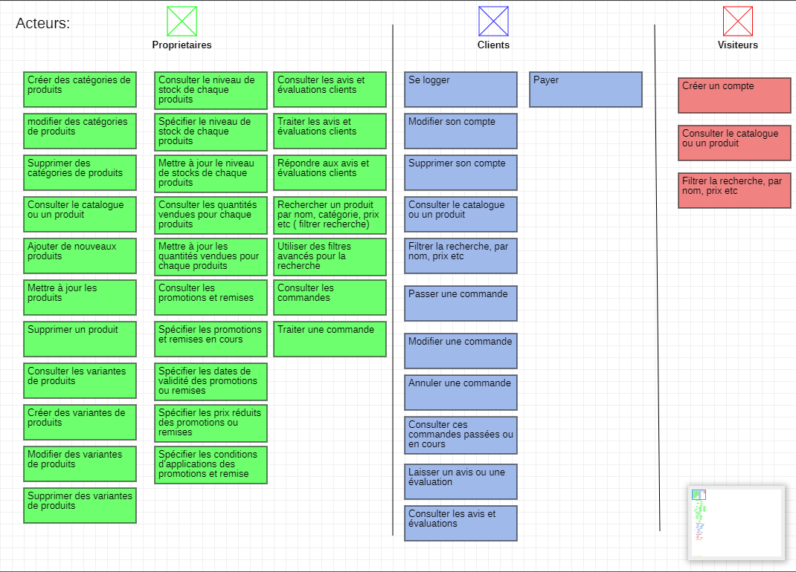

   ### use case

   
use case 1 

   
use case 2 

   
use case 3 

   
use case 4

   ### MCD / MLD:
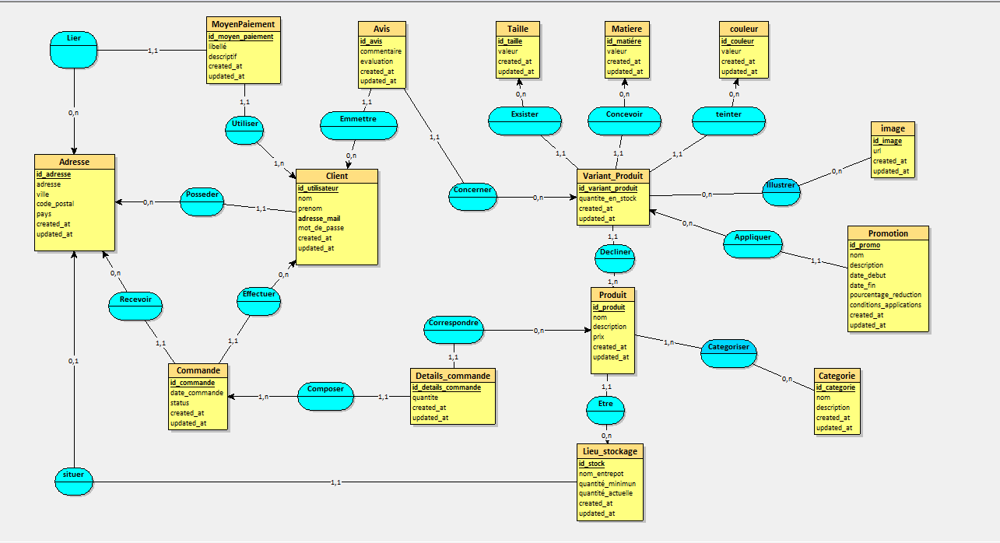
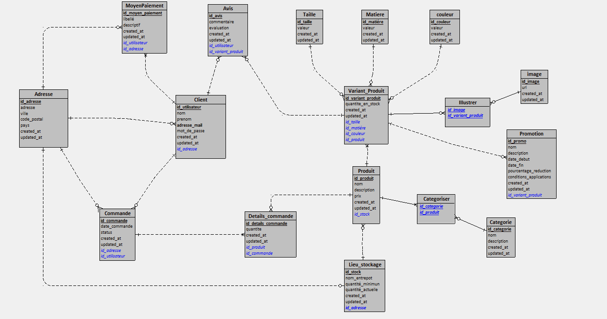

   ### régles de cardinalités

   
Mes différentes cardinalités

   
 
régle 1:

   -un produit appartient à 1 ou plusieurs catégories
   / une catégorie catégorise 0 ou plusieurs produits

 
régle 2:

   -un lieu de stockage stock 0 ou plusieurs produits
   / un produit se trouve dans 1 et 1 seul lieu de stockage

 
régle 3:

   -un produit est décliné en 1 ou plusieurs variant produit
   / un variant produit correspond à 1 et 1 seul produit

 
régle 4:

   -un produit peut correspondre à 0 ou plusieurs détails de commande
   / un détail de commande correspond à 1 et 1 seul produit

 
régle 5:

   -un lieu de stockage se situe à 1 et 1 seule adresse
   / une adresse est attribuée à 0 ou 1 lieu de stockage

 
régle 6:

   -un  détail de commande compose 1 et 1 seul commande
   / une commande est composée de 1 ou plusieurs détails de commande

 
régle 7:

   -un  détail de commande compose 1 et 1 seul commande
   / une commande est composée de 1 ou plusieurs détails de commande

 
régle 8:

   -une commande est reçue à 1 et 1 seule adresse
   / une adresse peut recevoir 0 ou plusieurs commandes

 
régle 9:

   -une commande est effectuée par 1 et 1 seul client
   / un client peut effectuer 0 ou plusieurs commandes

 
régle 10:

   -un client posséde 1 et 1 seule adresse
   / une adresse est possédée par 0 ou plusieurs clients

 
régle 11:

   -un moyen de paiement est utilisé par 1 et 1 seul client
   / un client utilise 1 ou plusieurs moyens de paiements

 
régle 12:

   -un client peut emmmettre 0 ou plusieurs avis
   / un avis est emis par 1 et 1 seul client

 
régle 13:

   -un avis concerne 1 et 1 seul variant_produit
   / un variant produit est concerné par 0 ou plusieurs avis

 
régle 14:

   -un variant produit exsiste en 1 et 1 seule taille
   / une taille peut concerner 0 ou plusieurs produit variant

 
régle 15:

   -un variant produit est conçu en 1 et 1 seule matière
   / une matière peut concerner 0 ou plusieurs produit variant

 
régle 16:

   -un variant produit est coloré en 1 et 1 seule couleur
   / une couleur peut concerner 0 ou plusieurs produit variant

 
régle 17:

   -un variant produit peut être illustrer par 0 ou plusieurs images
   / une image illustre 0 ou plusieurs produit variant

 
régle 18:

   -un variant produit peut être concerner par 0 ou plusieurs promotions
   / une promotion est appliqué à 1 et 1 seul produit variant

### régles métiers et contraintes divers

 
Unicité:

   
   * lors de la création d'un produit son nom doit être unique 
   * lors de la crétaion d'une catégorie son nom doit être unique  
   * lors de la création d'une taille sa valeur doit être unique  
   * lors de la création d'une couleur sa valeur doit être unique  
   * lors de la création d'une matiére sa valeur doit être unique
 

 
Produit:

   
   * lors de la création d'un produit son ID n'a pas à être renseigné 
   * lors de la création d'un produit son nom est OBLIGATOIRE  type string
   * lors de la création d'un produit son prix est OBLIGATOIRE  type float
   * lors de la création d'un produit sa description est OBLIGATOIRE type string 
   * lors de la création d'un produit l'ID du stock est OBLIGATOIRE et doit CORRESPONDRE à un stock exsistant en base type int 
   * lors de la création d'un produit son created_at est NON REQUiS type timestamp currentDate 
   * lors de la création d'un produit son updated_at est NON REQUiS type timestamp currentDate , attributs(updated on UPDATE)
  
 Pour les 4 'OBLIGATOIRES', je ne souhaite pas enregistré en base de donnée un produit incomplet, en effet nous avons vu dans les use case que les acteurs pouvaient  
 consulter le catalogue de produit et je ne souhaite pas qu'ils tombe sur un produit donc il manquerais des informations.  
 Et pour moi, un produit à obligatoirement un lieu de stockage exsistant en bdd pour la traçabilité

 ⚠ ici les régles sont loin d'être complétes , je vais les ajouter à la suite lors de la mise en place des différents services 
 
### Controller/services/data

 
Controller:

   
   Point d'entrée de l'api via le routing son role se limite à faire les controles standard (input null or empty, sanitize ..) puis apellé le service de la couche        business concernée.
 

 
Services:

   
  Représente la couche business de mon aplication multicouches responsable du controle de la bonne application des régles métiers
         par exemple : lors de la création d'un produit c'est cette couche qui va controller que l'id du stock qu'elle à reçu du controller est bien un id présent en bdd au niveau des lieux de stockages en appelant la couche data concernée.
 

 
Data:

   
  Représente l'unique couche qui communique avec la base de données et qui peux intéragir avec. Elle n'a plus à se soucier des divers controles car ils ont étaient réalisés par les couches du dessus, sont rôle n'est que d'effectuer des actions unitaires sur la base de données et de retourner à la couche supérieur (la business)   son retour, afin que cette derniére fasse remonter également son retour à la couche controller qui elle communique avec le client afin de lui renvoyer les résultats
 

### requetages bdd / postman

 
exemple 1 requete bdd

   requete pour afficher des informations concernant les ou les produits de taille 'S' en 'Blanc' et en 'Coton'
   
select produit.nom,produit.description,produit.prix ,vp.id_variant_produit,vp.quantite_en_stock,t.valeur as taille,c.valeur as couleur ,m.valeur as matière
from produit
inner join variant_produit as vp on(produit.id_produit=vp.id_produit)
INNER JOIN taille AS t on (t.id_taille=vp.id_taille)
inner join couleur as c on (c.id_couleur=vp.id_couleur)
inner join matiere as m on(m.id_matiere=vp.id_matiere)
where t.valeur="S" and c.valeur="Blanc" and m.valeur="coton" 

  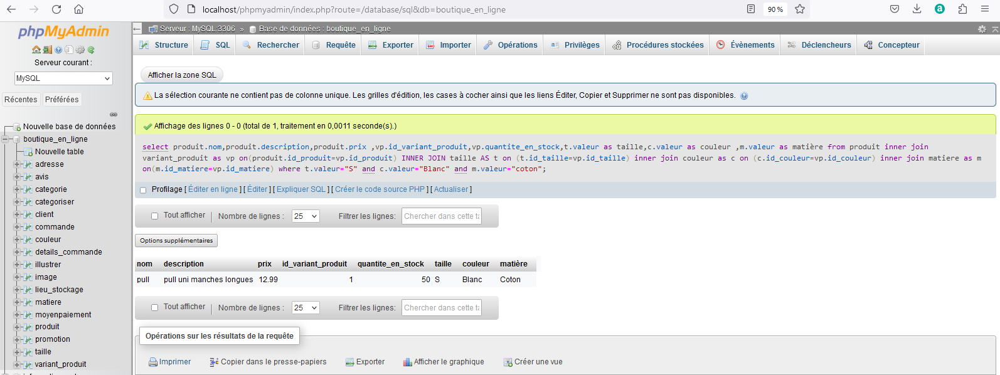

 
exemple  2 requete bdd

   requete pour afficher des informations ( nom, prenom, adresse, produit, commandé, quantité etc) concernant la commande n ° 1

select c.nom,c.prenom,adresse.adresse,adresse.ville,adresse.code_postal,adresse.pays,p.nom,p.description,p.prix,dt.quantite as quantité_commandé 
from adresse
inner join client as c on (c.id_adresse=adresse.id_adresse)
inner join commande as co on(co.id_utilisateur=c.id_utilisateur)
inner join details_commande as dt on (dt.id_commande=co.id_commande)
inner join produit as p on (p.id_produit=dt.id_produit)
where co.id_commande=1

  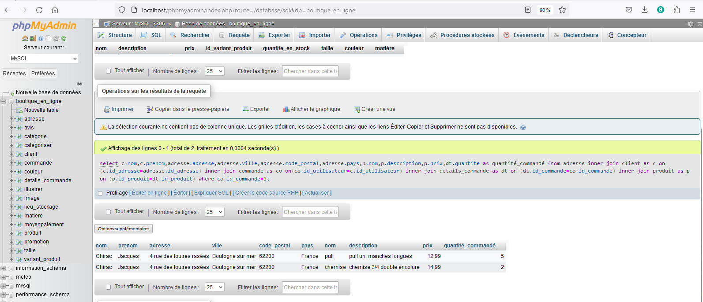

   
divers requete postman

voici quelque retour postman
on peut voir différent rétour d'erreur selon si c'est dans le controler, le service, ou la couche d'acces au donnéees où il y a une une erreur
l'erreur  et ou la response est différente selon ou elle est catch

 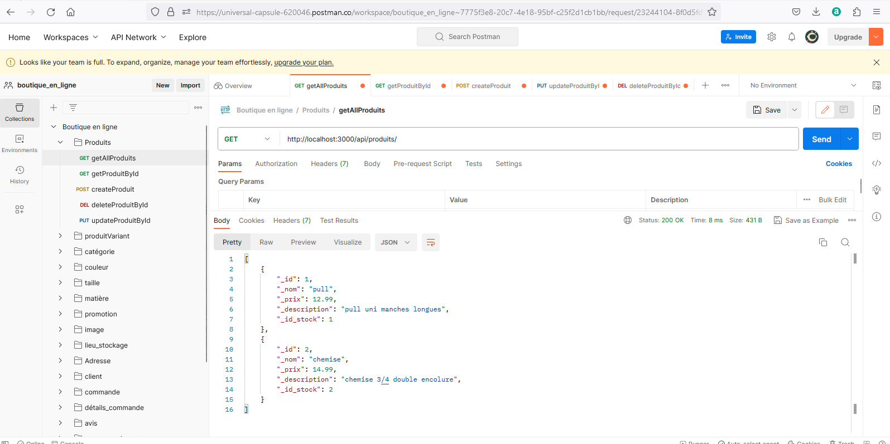
 
 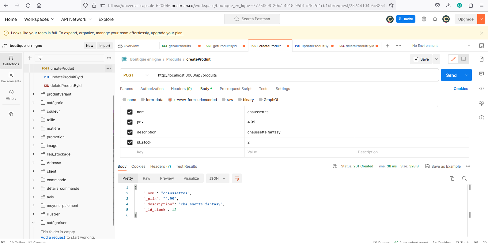
 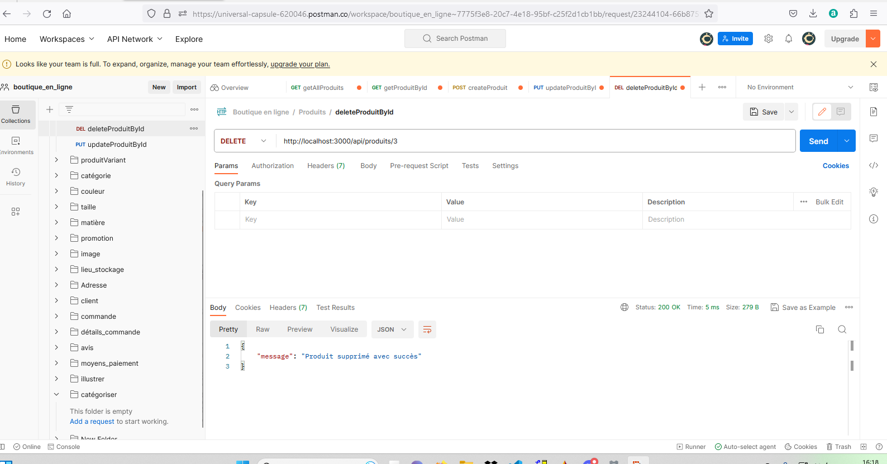
 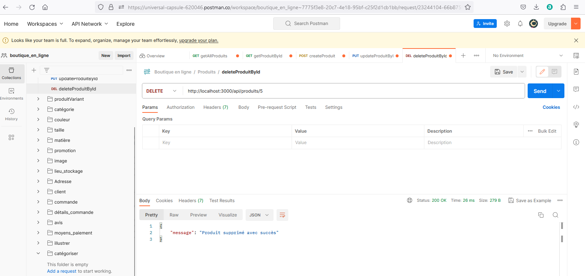
 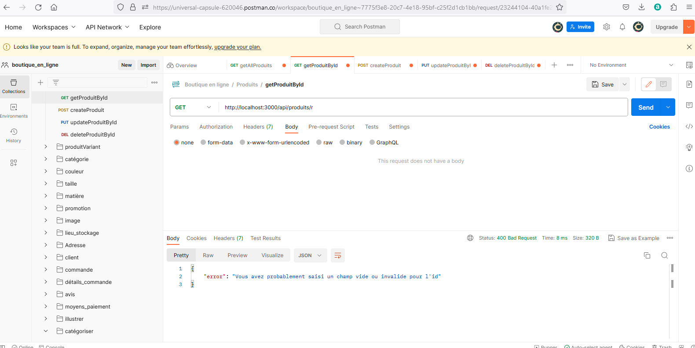
 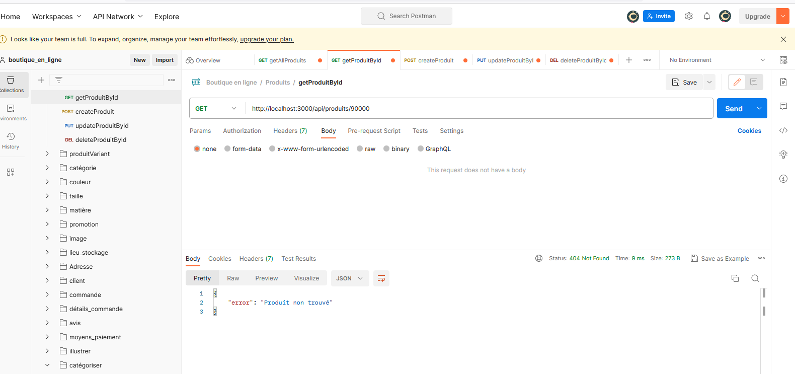

## IOC/DI:

   
IOC (Inversion of Control)

    L'Inversion de Contrôle est un principe de conception logicielle qui vise à inverser le flux de contrôle d'une application. Dans une application classique, on a le contrôle sur la manière dont les différentes parties du code interagissent les unes avec les autres. Avec l'IOC, cette responsabilité est déléguée à un conteneur ou un framework qui gère les dépendances et les relations entre les composants de l'application. L'IOC favorise donc la modularité, la réutilisabilité et facilite les tests unitaires en permettant de remplacer facilement les dépendances par des faux objets (mocks) lors des tests.

    ⚠ Je ne suis pas encore parvenu à mettre en place le contenaire dans mon apllication, mais ce n'est que partie remise, mais tu en trouveras trace dans les commentaires du code
 

   
DI (Dependency Injection)

    L'Injection de Dépendances est un concept étroitement lié à l'IOC. Il s'agit d'un moyen de mettre en œuvre l'IOC en permettant aux dépendances d'un objet d'être injectées par un composant externe. Au lieu de créer directement les objets dont il a besoin, un objet dépendant les reçoit via un constructeur, une méthode ou des propriétés, sans avoir à les instancier lui-même. Cela rend le code plus flexible, car les dépendances peuvent être facilement changées ou mises à jour sans avoir à modifier l'objet dépendant. Le DI facilite également la gestion des dépendances et la réduction des couplages entre les composants.

    ⚠ idem faute de contenaire je ne suis pas parvenu à le mettre en place, mais tu en trouveras trace dans les commentaires du code, je ne suis pas loin, en tout cas je comprend le principe, me reste à l'appliquer
 

 ## Commentaires divers:

 Grâce à se projet, les derniéres semaines de formation, l'entreprise, les recherches et nos divers discutions, j'appréhende mieux le concept de multicouches, à chaque couche sa taches et son utilité.

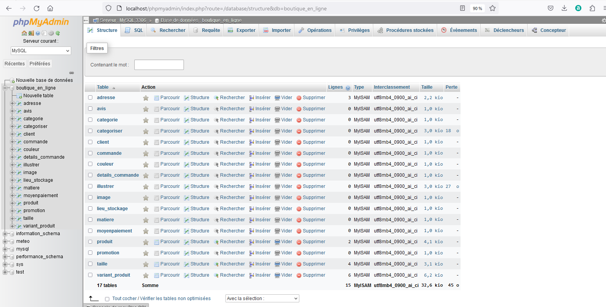

j'appréhende  également mieux le concept de DI/IOC même si je dois encore travailler sa mise en place.

   
liens utiles

                *  https://blog.logrocket.com/dependency-injection-node-js-typedi/
                *  https://grafikart.fr/tutoriels/ioc-container-facades-473
                *  https://medium.com/ividata-link/c-linjection-de-d%C3%A9pendances-di-et-l-inversion-de-contr%C3%B4le-ioc-48dbe76cff6b
                *  https://jsmanifest.com/dependency-injection-container-in-javascript/
 

 ## Installation/Mise en route:

   l'api tourne sous node, la bdd mysql est hébergé en localhost avec wamp 

   
images

   
       

   🖢 ici il faudra un .env a la racine du projet avec   host, username, password et nom de la bdd, ou modifier les infos selon les tiennes      
 

   
étapes

                1. cloner le repo
                2. npm i pour installer les dépendance
                3. créer et configurer le .env
                4. dans la console ==>   babel-node server.js
 

